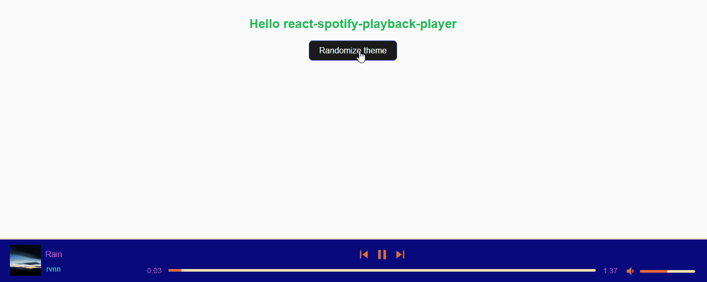

# react-spotify-playback-player

[](https://badge.fury.io/js/react-spotify-playback-player) [](https://react-spotify-playback-player.vercel.app/) [](https://bundlephobia.com/package/react-spotify-playback-player)

## 👋 Welcome to react-spotify-playback-player

### This component is a player that is able to play songs via [Spotify Web Playback](https://developer.spotify.com/documentation/web-playback-sdk/)

This component works in an agnostic way to the SDK implementation in your application, you can build your application the way you want and only pass the props necessary for the component to work, these props can be obtained in the official documentation of the Playback SDK, you can go to the link here: [Spotify Web Playback Documentation](https://developer.spotify.com/documentation/web-playback-sdk/quick-start/#controlling-playback)

You can see a demonstration of how this component works at this link: [React Spotify playback player demo](https://react-spotify-playback-player.vercel.app/)
For this you must have a valid Spotify token and a premium account, which is required to use the Playback API

### Setup

First you must install the component, you can do it in these ways for example:

`npm i react-spotify-playback-player@latest`

or

`yarn add react-spotify-playback-player`

### Integration

The integration of this component is agnostic to your application, that means you can do it in several ways, in this example I will use an SDK library you can find it at this link: [react-spotify-web-playback-sdk](https://www.npmjs.com/package/react-spotify-web-playback-sdk)

```typescript
import { useCallback } from "react";
import { SpotifyPlaybackPlayer } from "react-spotify-playback-player";
import "./App.css";

import {
  WebPlaybackSDK,
  usePlayerDevice,
  usePlaybackState,
  useSpotifyPlayer,
} from "react-spotify-web-playback-sdk";

export const App = () => {
  // your spotify token
  const token = process.env.token_example;

  const getOAuthToken = useCallback(
    (callback: (arg0: string) => any) =>
      callback(token?.replace("Bearer", "").trim()),
    [token]
  );

  return (
    <WebPlaybackSDK
      initialDeviceName="Spotify example"
      getOAuthToken={getOAuthToken}
      initialVolume={0.5}
    >
      <h2>Hello react-spotify-playback-player</h2>
      <Player />
    </WebPlaybackSDK>
  );
};

export const Player = () => {
  // spotify sdk playback methods, you can get them any way you like
  const device = usePlayerDevice();
  const player = useSpotifyPlayer();
  const playback = usePlaybackState();

  return (
    <SpotifyPlaybackPlayer
      playback={playback || undefined}
      player={player || undefined}
      deviceIsReady={device?.status}
    />
  );
};
```

This example generated this screen, as you can see it is fully functional, in this example I use the official Spotify application but you can do these interactions from within your application without any problems.

🎉 Works fine


### Functional properties

Important, no properties are required but if you don't pass any of them it changes the player's operation, for example if you don't pass the `player` prop the component will not be rendered until it receives the property.

| Name          | Is required | type                                                                                                           | Description                                                                                                                                                                         |
| ------------- | ----------- | -------------------------------------------------------------------------------------------------------------- | ----------------------------------------------------------------------------------------------------------------------------------------------------------------------------------- |
| children      | false       | ReactNode                                                                                                      | Allows you to pass react components into the player, but it is not recommended                                                                                                      |
| player        | false       | [Player](https://github.com/ArielBetti/react-spotify-playback-player/blob/main/src/interfaces/index.ts)        | This property expects to receive the player coming from the [Spotify Playback SDK](https://developer.spotify.com/documentation/web-playback-sdk/quick-start/#installation)          |
| playback      | false       | [PlaybackState](https://github.com/ArielBetti/react-spotify-playback-player/blob/main/src/interfaces/index.ts) | This property expects to receive the player coming from the [Spotify Playback SDK](https://developer.spotify.com/documentation/web-playback-sdk/quick-start/#installation)          |
| deviceIsReady | false       | `'ready' \ 'not_ready'`                                                                                        | This property expects to receive the device state, you can get it in [Spotify Playback SDK](https://developer.spotify.com/documentation/web-playback-sdk/quick-start/#installation) |
| onLinkClick | false | [ILinkClick](https://github.com/ArielBetti/react-spotify-playback-player/blob/main/src/interfaces/index.ts) | This property asks for a call back it returns the attributes of the track's title elements and the player's artists in the form of `name\uri\link`

### Customization

You might want to customize your component to suit the rest of your application, every color change the component will react dynamically with no reloads needed, just change the `theme` prop

```typescript
export const Player = () => {
  // spotify sdk playback methods, you can get them any way you like
  const device = usePlayerDevice();
  const player = useSpotifyPlayer();
  const playback = usePlaybackState();

  // You can dynamically receive a theme if your application has more than one
  const newTheme = {
    backgroundColor: "#0f172a",
    disabledColor: "#475569",
    highLightColor: "#EA047E",
    primaryTextColor: "#f9fafb",
    secondaryBackgroundColor: "#1e293b",
    secondaryTextColor: "#cbd5e1",
    popOverColor: "#000000",
  };

  return (
    <SpotifyPlaybackPlayer
      playback={playback || undefined}
      player={player || undefined}
      deviceIsReady={device?.status}
      theme={newTheme}
    />
  );
};
```

This will generate something like this:


Your application can be an arc with multiple themes, no problem this solution is robust enough for all designs!



### Cutomization properties

The props are defined in the `theme` property example: `theme={{ backgroundColor: '#000000' }}`.

| Name                     | Is required | type   | Description                                                                                  |
| ------------------------ | ----------- | ------ | -------------------------------------------------------------------------------------------- |
| backgroundColor          | false       | string | Sets the main color for the player shape                                                     |
| highLightColor           | false       | string | Sets the color of active icons, progress bars and anything else that needs to be highlighted |
| primaryTextColor         | false       | string | Defines main text color, recommended to always contrast with backgroundColor                 |  |
| secondaryBackgroundColor | false       | string | Sets the secondary color of the player, used to contrast the progress bars for example       |
| secondaryTextColor       | false       | string | Defines secondary text color, recommended to always contrast with                            |
| disabledColor            | false       | string | Sets color for disabled elements                                                             |
| popOverColor             | false       | string | Sets color for the popOver used in `floatbar` views                                          |


### Callback events

You might want to get the id of the artists or the track played, for that you can use `onLinkClick` which returns a callBack 'event.link'.

```typescript
const onLinkClick = (event: { link?: string }) => {
  if (event?.link) {
    return setLinkTarget(event.link);
  }
};

return (
  <SpotifyPlaybackPlayer
    playback={playback || undefined}
    player={player || undefined}
    deviceIsReady={device?.status}
  />
);
```

## how to contribute

> ```
> tag: description
> ```
>
> The **tag** must be the type of change, following the reference that will be below with checkbox;\
> And the **description** should be a simple commit message, covering all changes within PR;

### What kind of changes does this code review introduce? (Tag)

- [ ] `feat` New functionality
- [ ] `fix` Bug fix
- [ ] `docs` Documentation update
- [ ] `refact` Code change that is neither new functionality nor bug fixes
- [ ] `perf` Performance improvement
- [ ] `test` Adding, changing or removing tests
- [ ] `build` Change in build process or external dependencies
- [ ] `ci` Pipeline or publishing flow change
- [ ] `chore` Other changes that do not modify base files or test files
- [ ] `revert` Rollback of previous commits

**Example**: `feat/tip-card-component`
